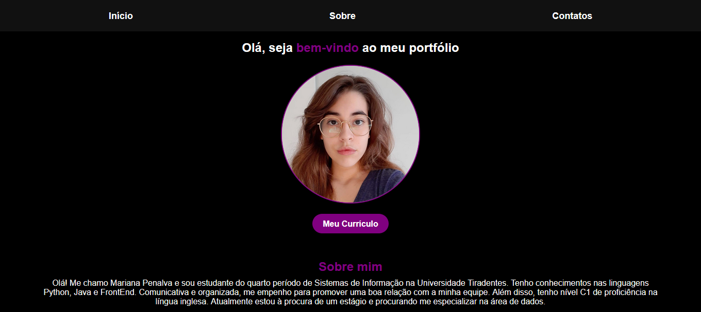

# Projeto Portfólio 👾

## Apresentação 
Esse é meu portfólio. Esse projeto foi desenvolvido com o intuito de criar um espaço centralizado onde posso apresentar a mim, as minhas habilidades e as formas de se estabelecer contato comigo.

 

[Acesse o site aqui](https://maripenalv.github.io/portfolio/) 

## Funcionalidades 
- Sumarização acerca de quem sou e foto de perfil.
- Link direto para meu currículo.
- Links das minhas redes para melhor, e mais fácil, comunicação.
- Navegação intuitiva e responsividade.

## Tecnologias utilizadas 
- HTML
- CSS

## Status do projeto 
- Incompleto, algumas adições e mudanças ainda serão feitas.
